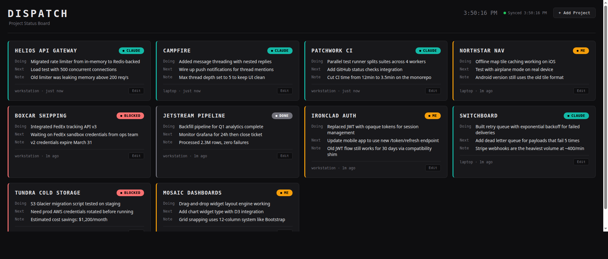

# Tracking Multiple Claude Code Projects With a Status Dashboard

I run Claude Code on multiple projects across 2 machines and I kept losing track of where things were. What did Claude do in that project? What's blocked? What was I supposed to pick up next? I've seen other people on Reddit dealing with the same thing.

I ended up building a dashboard for it called Dispatch.

## What it does



Each project gets a card on the board. The color tells you the state so you can see at a glance where things are. Amber means it's your turn, teal means Claude is actively working, red means something is blocked, and gray means it's done. You can click into any card to see the full update history for that project.

## How it works

Each project has a `CLAUDE.md` file with instructions that tell Claude to post status updates via curl. Claude reads that file when a session starts and then posts updates on its own throughout the session, including what it's working on, what needs to happen next, and any gotchas worth knowing about.

The server is Node with SQLite for storage and the dashboard is just vanilla HTML with no build step. The whole thing sits behind Tailscale so both of my machines can reach it.

There's a setup script that adds the `CLAUDE.md` instructions to any project in one line:

```bash
curl -fsSL https://raw.githubusercontent.com/timothyjeffcoat/dispatch/master/setup.sh | bash -s -- --url http://YOUR_IP:3131 --project my-project
```

## Why not hooks

The first thing I tried was Claude Code's Stop hook but it didn't really work out. The hook fires after Claude exits so it has no idea what actually happened during the session. Every project just ended up saying "Claude session ended" with no real detail about the work.

Putting the instructions in `CLAUDE.md` works a lot better because Claude posts the update while it still has the full context of what it did. The server also recognizes those generic hook messages and filters them out so they don't clutter up the board.

## Security

There's no auth on the server itself because Tailscale handles that. Only devices on my tailnet can reach it and it's not exposed to the public internet. For a tool that only I use that's the right tradeoff.

The server still has rate limiting, input validation, security headers, and XSS prevention built in. If someone wanted to run this on an open network they would want to add an API key or put a reverse proxy in front of it.

## Stack

Node.js, Express 5, SQLite, vanilla JS, PM2, Tailscale.

## Repo

https://github.com/timothyjeffcoat/dispatch

There's a `PROMPT.md` in the repo if you want to build your own version with a different stack.
